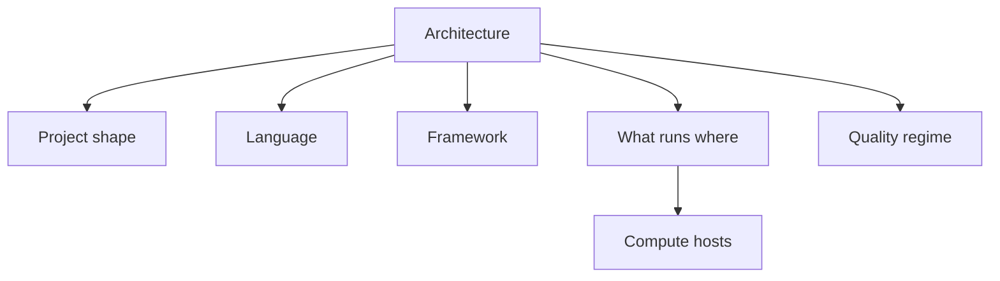

# Architecture

When [Deliver](../flow/02-deliver.md) or [Maintain](../flow/04-maintain.md) needs a bet, answer these **orthogonal** questions. You do not have to climb them in lockstep for every project — open the chooser that matches the fire.

| Chooser | Question | Go |
| --- | --- | --- |
| **Project shape** | What kind of artifact? | [Project shapes](../paths/index.md) |
| **Language** | Which runtime / default? | [Language selection](../concepts/09-language-selection.md) |
| **Framework** | Which UI / docs stack (when web)? | [Web framework selection](../concepts/10-web-framework-selection.md) |
| **What runs where** | Which concerns live in browser / edge / API / worker / data / SaaS? | [What runs where](what-runs-where.md) |
| **Compute hosts** | Which concrete platform for a unit you still run? | [Compute](../paths/compute/index.md) — *after* placement |
| **Quality regime** | A / B / C proof & obs for this unit? | [Quality regimes](../concepts/11-quality-regimes.md) |

Coffee test and [`kiss`](../practices/kiss.md): defaults first; exceptions when the cutting board demands it — not taste.
