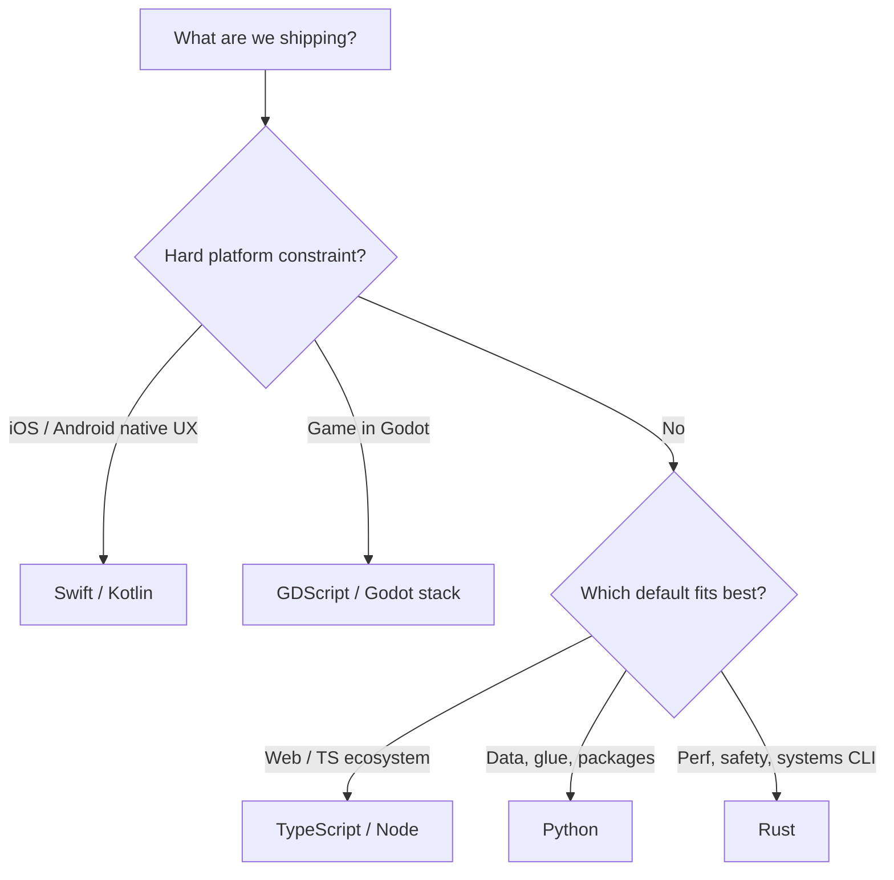

# Language selection

Pick a language the way you pick a knife: **defaults first**, exceptions only when the cutting board demands it. Do not collect runtimes for sport. Pair with [KISS](../practices/kiss.md) and [Vision-Tied Goals](08-vision-tied-goals.md).

## Default languages

Unless a hard constraint says otherwise, choose from:

| Language | Reach for it when… |
| --- | --- |
| **Python** | Data/ML adjacency, scripting, APIs, CLIs, packages ([Path 03](../paths/03-python-package.md)), glue |
| **Node / TypeScript** | Web UI and full-stack JS/TS, Vercel/edge-adjacent apps, most agent tooling, typed JS services |
| **Rust** | Performance, safety, CLIs/systems tools, WASM, places you’d regret GC pauses or footguns |

These three cover almost all greenfield work in this handbook’s stance. Prefer **one** primary language per deploy unit. A monorepo may mix them — that is earned, not default ([Path 04](../paths/04-monorepo.md)).

## Exceptions (native & games)

Use these when the **platform is the product surface**, not because they’re interesting:

| Exception | When it’s earned |
| --- | --- |
| **Kotlin** | Android (or shared Kotlin Multiplatform only if you already accepted that bet) |
| **Swift** | Apple platforms (iOS, macOS app targets that need native APIs/UI) |
| **Godot** (GDScript / Godot workflow) | Games and interactive Godot projects — stay in Godot’s stack instead of forcing a web/Python rewrite |

Still apply the coffee test: a marketing site is not an Android app; a Godot game is not “just TypeScript with canvases” unless that is a deliberate port.

## How to decide (short)

1. **Constraint first** — store, OS SDK, engine, or customer runtime that forces Kotlin/Swift/Godot.
2. **Else defaults only** — Python, TypeScript/Node, or Rust.
3. **Among defaults**, pick the one with the shortest honest path to the vision (ecosystem, team skill, deploy target).
4. **`kiss`** if you’re about to add a fourth language to a repo that has one deploy unit.
5. **`research-it`** only when two defaults both fit and the wrong choice is expensive to undo.

## Do / Don’t

**Do**

- Declare the language choice in README / `docs/PRODUCT.md` in one sentence
Match [compute](../paths/compute/index.md) to the language you picked (e.g. TS → Vercel/Node hosts; Rust/Python services → Docker/Fly/Cloud Run). For TS web UI, see [Web framework selection](10-web-framework-selection.md).
- Keep agent instructions (`AGENTS.md`) aligned with the real toolchain

**Don’t**

- Start in a new language “to learn” on a deadline product
- Mix Kotlin/Swift/Godot into a web monorepo without a native/game deploy unit
- Use Rust “for speed” before measuring — earn it
- Expand the default list casually; change this page deliberately if the house stack changes

## Where it shows up

- [Project paths](../paths/index.md) — choose shape after (or with) language
- [Python package](../paths/03-python-package.md) · [CLI](../paths/02-cli.md) · [Simple website](../paths/01-simple-website.md)
- Practices: [KISS](../practices/kiss.md) · [Research It](../practices/research-it.md) · [Repos](../practices/repos.md) `architecture`

## Agent skill

No dedicated skill — use `kiss` / `research-it` / `idk-now` when the language choice is the blocker. Record durable decisions with DocSlime ADR if the choice binds the repo.
