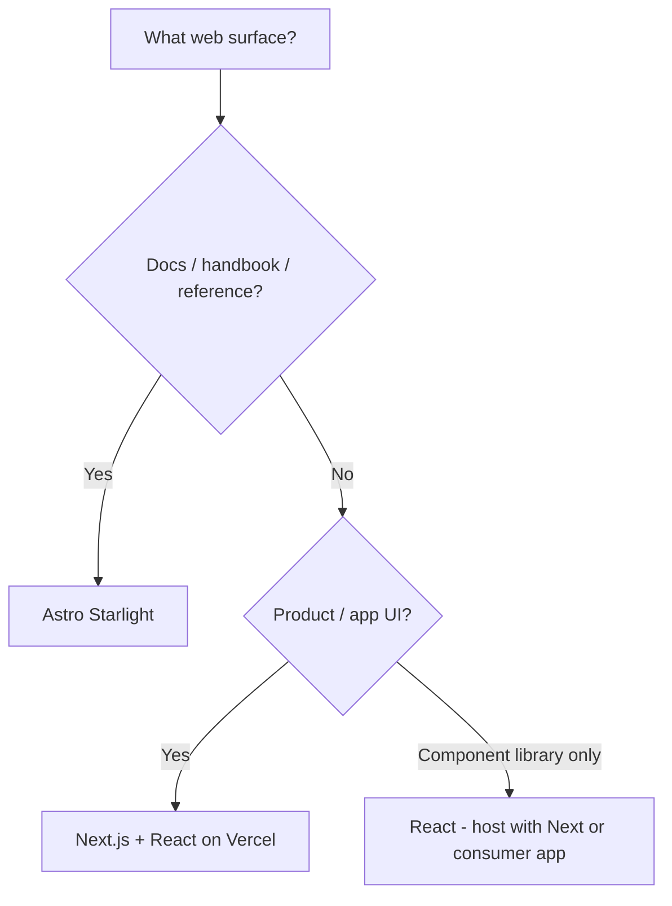

# Web framework selection

For **web UI and docs sites**, pick frameworks the way you pick languages: **defaults first**. Pair with [Language selection](09-language-selection.md) (almost always TypeScript here), [KISS](../practices/kiss.md), and [Compute — Vercel](../paths/compute/vercel.md) when the app is Next.js.

## Defaults

| Stack | Reach for it when… |
| --- | --- |
| **React** | Component UI, design systems, interactive product surfaces (often under Next.js) |
| **Next.js on Vercel** | App/product websites, previews per PR, full-stack React with App Router; **default host is Vercel** |
| **Astro Starlight** | Documentation sites, handbooks, skill/API reference sites (content-first, MD/MDX) |

React + Next.js (Vercel) covers product web. Starlight covers docs. Do not invent a third default for greenfield web without a hard constraint.

## How the defaults fit paths

| Path / compute | Usual pick |
| --- | --- |
| [Simple website](../paths/01-simple-website.md) — product/marketing app | Next.js + React → [Vercel](../paths/compute/vercel.md) |
| [Simple website](../paths/01-simple-website.md) — docs/handbook | Astro Starlight (GitHub Pages or any static host; this pack’s own docs site) |
| [Monorepo](../paths/04-monorepo.md) | Next app + Starlight docs as separate packages/units when both exist |
| Non-web paths (CLI, Python package) | N/A — don’t force a web framework |

## Exceptions (earned only)

Use something else when a **real constraint** wins — not taste:

- Existing codebase already on another framework (migrate deliberately, don’t dual-run forever)
- Hard requirement for a customer/platform stack
- Edge-only Cloudflare Workers sites where Starlight/Next are a poor fit — see [Cloudflare](../paths/compute/cloudflare.md), still prefer TS

Still prefer React mental models when you must leave Next, unless the constraint forbids it.

## Do / Don’t

**Do**

- Default product web → **Next.js + React on Vercel**
- Default docs → **Astro Starlight**
- Keep one UI framework per deploy unit; share a design system only when Path 04 needs it
- Use Impeccable for craft on React/Next surfaces

**Don’t**

- Start a docs site in Next “because we know React” when Starlight is the house default for docs
- Start a product app in Starlight (wrong tool)
- Add Remix/SvelteKit/Vue “to try” on a deadline
- Host Next on three platforms at once — Vercel is the default; change hosts with `kiss` + `research-it`

## Where it shows up

- [Language selection](09-language-selection.md) — TypeScript/Node for these stacks
- [Path 01 — Simple website](../paths/01-simple-website.md)
- [Compute — Vercel](../paths/compute/vercel.md)
- Practices: [KISS](../practices/kiss.md) · [Impeccable](../practices/impeccable.md) · [Document It](../practices/document-it.md)

## Agent skill

No dedicated skill — `kiss` / `research-it` / `idk-now` when framework choice is the blocker. Prefer Impeccable once the stack is Next/React.
