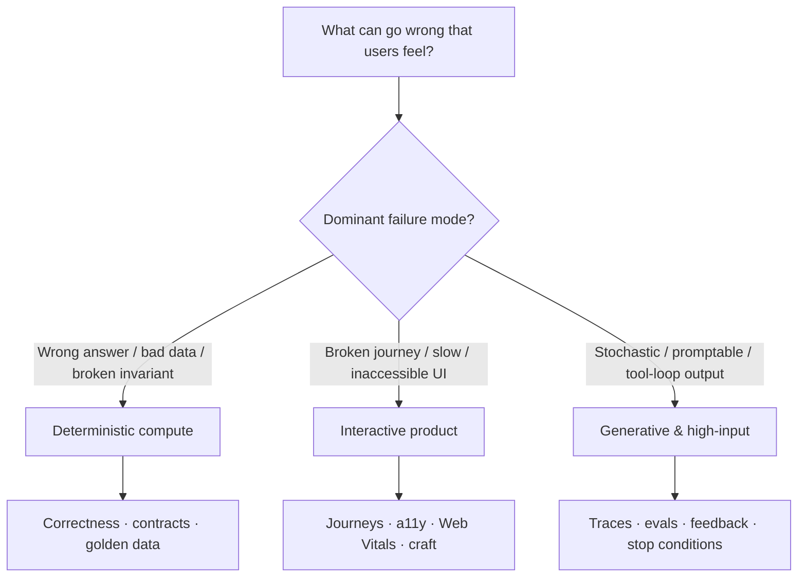

# Quality regimes

**Quality is not one pyramid.** What “good” means — and what evidence closes a change — depends on the *kind of system* you are shipping. Applying website E2E rituals to a batch pipeline, or unit-test theater to a chat agent, manufactures false peaks.

Name the regime before you reach for `test-it` / `observe-it` / `check-readiness`. Hybrids are normal (a Next.js product with an LLM surface is **Product + Generative**); score each surface by its own rules.

## Regime A — Deterministic compute

**Examples:** APIs, algorithms, services, analytics / ETL / batch pipelines, numerical code, authz logic.

**Quality means:** the right answer under the stated contract — invariants hold; outputs match golden or property expectations; pipelines are fresh, covered, and correct enough for the SLO.

**Evidence that counts**

| Prefer | Avoid treating as enough |
| --- | --- |
| Unit / property / golden-data tests; contract checks at boundaries | “Looks right in the debugger once” |
| Pipeline **freshness / coverage / correctness** SLIs (SRE Workbook) | Host CPU graphs with no data-quality signal |
| Schema & expectation suites (e.g. Great Expectations–style checks) for analytics | Dashboards that never fail CI when null rates explode |

**Skills bias:** `diagnose-bug` · `test-it` (narrow/fast + contract tests) · `observe-it` (errors, latency, *and* data SLIs) · `fix-it`

**Grounded in:** Google SRE — [service level objectives](https://sre.google/sre-book/service-level-objectives/) and [pipeline freshness / coverage / correctness](https://sre.google/workbook/implementing-slos/); [data-processing workbook](https://sre.google/workbook/data-processing/); Fowler [practical test pyramid](https://martinfowler.com/articles/practical-test-pyramid.html); [Great Expectations](https://docs.greatexpectations.io/) / data-contract practice for analytics trust.

## Regime B — Interactive products (websites & fullstack apps)

**Examples:** Marketing and docs sites, SaaS UIs, Next.js fullstack apps, design-system surfaces.

**Quality means:** users can complete jobs safely and pleasantly — journeys work, accessibility holds, perceived performance is good, craft matches the feeling north star.

**Evidence that counts**

| Prefer | Avoid treating as enough |
| --- | --- |
| Behavior tests + critical-path E2E (pyramid: many narrow, few broad) | Screenshot-only “LGTM” |
| Automated a11y checks + keyboard/screen-reader spot checks (WCAG) | Color contrast ignored because “design said so” |
| **Core Web Vitals** field data (LCP / INP / CLS) plus lab budgets in CI | Lab green while field p75 is red |
| ProductFeeling / Impeccable when emotion and craft are product requirements | Funnel metrics alone as UX quality |

**Skills bias:** `test-it` · `troubleshoot-app` · `observe-it` (RUM / vitals / errors) · Impeccable · ProductFeeling · `document-it`

**Grounded in:** [web.dev Web Vitals](https://web.dev/articles/vitals) / [Google Search — Core Web Vitals](https://developers.google.com/search/docs/appearance/core-web-vitals); [W3C WCAG](https://www.w3.org/WAI/standards-guidelines/wcag/); Fowler test pyramid; NN/g usability / peak–end (see ProductFeeling lineage).

## Regime C — Generative, non-deterministic, high user-input

**Examples:** Chat / copilots, agents with tools, RAG, open-ended generation, any surface where the same input can yield many acceptable (or catastrophic) outputs.

**Quality means:** outputs are *good enough, often enough, safely* — measured by evals and production traces, not by a single golden string. User input is an attack and variance surface (prompt injection, unbounded agency).

**Evidence that counts**

| Prefer | Avoid treating as enough |
| --- | --- |
| Hierarchical **traces** (LLM calls, retrieval, tools) via OTel-friendly stacks | Logs that only say `status=200` |
| Offline **datasets + experiments**; online scores; user feedback as scores | “Tried three prompts in the playground” |
| Layered graders: code/heuristic where possible → LLM-as-judge (calibrated) → human for edges ([Anthropic evals](https://www.anthropic.com/engineering/demystifying-evals-for-ai-agents)) | Unit tests that assert exact free-text equality |
| Stop conditions, allow/deny tools, cost/latency budgets ([OWASP LLM](https://owasp.org/www-project-top-10-for-large-language-model-applications/), [NIST AI RMF](https://www.nist.gov/itl/ai-risk-management-framework) Measure/Manage) | Infinite retries / unbounded tool loops |

**House default for LLM observability & evals:** [Langfuse](https://langfuse.com/) (OpenTelemetry-based tracing, datasets, scores, prompt workflows) — same role Pulumi ESC plays for secrets: preferred unless the repo already standardized on another OTel-capable eval stack. Companion skill: vendored / Codex `langfuse` when operating the platform.

**Skills bias:** `agents analyze|design|optimize` · `test-it` (eval harnesses / dataset gates) · `observe-it` (traces + quality scores, not only golden signals) · `agents slap` when loops thrash · Langfuse skill for instrumentation and score workflows

**Grounded in:** Anthropic — [Demystifying evals for AI agents](https://www.anthropic.com/engineering/demystifying-evals-for-ai-agents) and [Building effective agents](https://www.anthropic.com/engineering/building-effective-agents); NIST AI RMF; OWASP Top 10 for LLM Apps; OpenTelemetry; Langfuse docs (tracing + evaluation).

## How to choose (coffee test)

1. **What fails loudly if quality is wrong?** Wrong invoice (A), broken checkout (B), jailbroken / hallucinated advice (C).
2. **Is the oracle deterministic?** If yes → A. If UX/journey → B. If many valid answers or model-in-the-loop → C.
3. **Don’t launder regimes.** A green Jest suite does not prove chat quality; a Langfuse score does not prove SQL invariants.
4. **Hybrids:** document which surfaces are A/B/C in `TESTING.md` / DocSlime and gate each with the matching evidence.
5. **Unpaid interest is still a bug** — docs, framing, feedback, data, or toil failures count ([Bugs & debt](12-bugs-and-debt.md)).
6. **Use the quality trace** — DocSlime + lightweight BDD scenarios before inventing a private Definition of Done ([Quality trace](13-quality-trace.md)).

## Where it shows up

[Evidence over Vibes](04-evidence-over-vibes.md) · [Bugs & debt](12-bugs-and-debt.md) · [Quality trace](13-quality-trace.md) · practices [Test It](../practices/test-it.md) · [Observe It](../practices/observe-it.md) · [Check Readiness](../practices/check-readiness.md) · [DocSlime](../practices/docslime.md) · [Diagnose Bug](../practices/diagnose-bug.md) · [Design Agents](../practices/design-agents.md) · [Sources](../sources.md)
