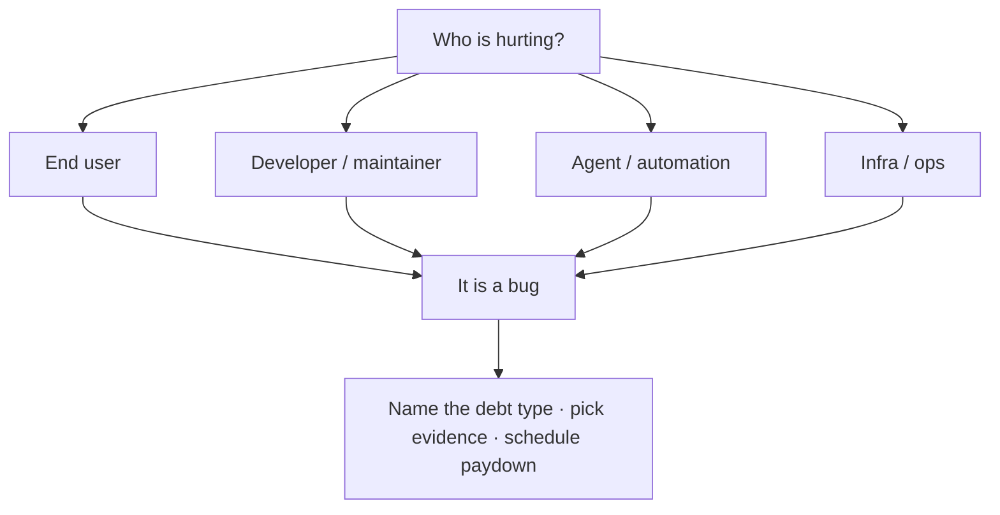

# Bugs & debt

**A bug is a bug is a bug.** It does not matter whether the pain shows up in runtime code, a pipeline, a dashboard, a README, an agent loop, a deploy script, or the story you sold the customer. If someone who experiences the built product — user, developer, agent, or infrastructure operator — hits a broken, confusing, or falsely promised experience, that is a bug. Taxonomy labels (debt types, severity, regime) help you *pay* it; they do not demote it to “not really a bug.”

This stance comes from the Silicon Valley **bug-council / BugSplat** culture later associated with Bugzilla: *treat everything that needs fixing as a bug in one coherent list* — missing docs, confusing UX, bad performance, unfinished features, and classic defects alike ([Everything’s a bug (or an issue)](https://www.bozemanpass.com/everythings-a-bug-or-an-issue/)). Relabeling pain as “just a feature request,” “just tech debt,” or “just a paper cut” is how backlogs launder work into permanent interest.

## Debt is interest on unpaid bugs

[Ward Cunningham’s](https://martinfowler.com/bliki/TechnicalDebt.html) debt metaphor: shipping with incomplete understanding (or expedient structure) buys speed *if* you repay by aligning the system with what you now know. Interest is the extra stumble every time you touch the disagreement.

In this handbook:

- **Bug** = a concrete experience failure (now or reliably soon).
- **Debt** = known bugs and known misalignments you are *carrying* — paying interest in slowdowns, toil, wrong decisions, or unmet expectations.
- **Feature** = new promise. Until it ships, an *advertised* capability that isn’t there is still an experience bug for the person who believed the framing ([Atwood](https://blog.codinghorror.com/thats-not-a-bug-its-a-feature-request/) on the false bug/feature split from the user’s seat).

[Fowler’s Technical Debt Quadrant](https://martinfowler.com/bliki/TechnicalDebtQuadrant.html) (prudent/reckless × deliberate/inadvertent) still applies — but “prudent deliberate debt” must stay *visible as bugs* with a repayment plan, not vanish into folklore.

## Debt types (name the interest)

Use these labels on issues so agents and humans pick the right cut. One bug can wear several labels; lead with the one that names the *interest*.

| Debt type | What interest feels like | Typical experiencer |
| --- | --- | --- |
| **Development debt** | Slow change, fragile merges, duplicated logic, fear of touching a module | Developers, agents writing code |
| **Architecture / design debt** | Wrong boundaries, leaky APIs, can’t deploy independently | Developers, infra |
| **Data debt** | Bad schemas, silent null storms, unverified pipelines, “dashboard lies” | Users of data, analytics, agents reading truth |
| **Test / proof debt** | Regressions, flaky CI, no oracle for the regime | Everyone who trusts the green check |
| **Observability debt** | Blind incidents, no traces/scores, alert fatigue without signal | Ops, agents debugging |
| **Documentation & maintainability debt** | Tribal knowledge, wrong runbooks, onboarding thrash | Developers, agents, future you |
| **Understanding / behavior / feedback debt** | Product or agent behavior you can’t explain or measure; missing evals, missing user feedback loops | Users, PMs, agent operators |
| **Infrastructure / toil debt** | Manual releases, snowflake envs, pager that doesn’t teach | Ops, developers ([SRE toil](https://sre.google/sre-book/eliminating-toil/)) |
| **Security / supply-chain debt** | Long-lived secrets, unpinned actions, known vulns deferred | Everyone after the breach |
| **Product-framing / unmet-expectation debt** | Marketing, README, sales, or UX copy promises a reality the system doesn’t deliver | End users (trust burns hottest here) |
| **Craft / UX debt** | Inconsistent UI, a11y gaps, feeling north star violated | End users (ProductFeeling / Impeccable) |

Academic and practitioner taxonomies already split code, architecture, documentation, test, and defect debt ([Alves et al. mapping study](https://www.sciencedirect.com/science/article/abs/pii/S0164121214002854)); product/UX debt appears in practitioner writing on [product debt](https://funnelfiasco.com/blog/2015/04/07/product-debt/). This table is the house cut aligned to [quality regimes](11-quality-regimes.md) and who pays interest.

## How this interacts with quality regimes

Debt type ≠ quality regime, but they couple:

- Regime **A** (compute) debt often shows as data, test, and development debt.
- Regime **B** (product) debt often shows as craft/UX, framing, and journey/test debt.
- Regime **C** (generative) debt often shows as understanding/feedback debt (no traces, no evals) plus stop-condition / agency bugs.

A green unit suite that ignores chat quality is **test debt in regime C**, still a bug for the user who got a bad answer.

## How DocSlime + BDD make bugs falsifiable

Without a shared expected behavior, “bug” collapses into opinion wars. The [quality trace](13-quality-trace.md) is the house oracle:

- **DocSlime** holds durable PRODUCT, experience, REQUIREMENTS, TESTING, OBSERVABILITY (and ADRs).
- **Lightweight BDD** (Given/When/Then completion scenarios on issues and in TESTING — not mandatory Cucumber) states what “behaving correctly” means ([Dan North](https://dannorth.net/blog/introducing-bdd/)).
- **Experience ≠ scenario Then** → bug (file it).
- **Missing / stale scenario or doc map** → documentation, framing, understanding, or test/proof debt — still on the bug list.

`check-readiness` and `test-it` exist to walk that map; `docslime-fill` exists so the map isn’t invented mid-incident.

## Working rules

1. **File it.** If it hurts an experiencer, it belongs on the list (`issues`) — not only in a chat apology.
2. **Don’t launder.** “Won’t fix / feature request / tech debt” without priority and owner is how interest compounds. Prefer: bug + debt label + severity + next skill.
3. **Pay interest deliberately.** Small continuous repayment beats bankruptcy weekends ([Cunningham](https://martinfowler.com/bliki/TechnicalDebt.html); [kiss](../practices/kiss.md) when complexity is the unpaid principal).
4. **One write owner** for the fix ([Work ownership](06-work-ownership.md)) — bug-council culture assigned *one* person at a time.
5. **Evidence matches the regime** ([Evidence over vibes](04-evidence-over-vibes.md)) — fixing framing debt may be copy + honesty, not more code.
6. **Prefer the quality trace** ([DocSlime + BDD](13-quality-trace.md)) before inventing a private definition of done.

## Where it shows up

[Issues](../practices/issues.md) · [KISS](../practices/kiss.md) · [Tidy Up](../practices/tidy-up.md) · [Refactor It](../practices/refactor-it.md) · [Document It](../practices/document-it.md) · [DocSlime](../practices/docslime.md) · [Observe It](../practices/observe-it.md) · [Test It](../practices/test-it.md) · [Check Readiness](../practices/check-readiness.md) · [Quality regimes](11-quality-regimes.md) · [Quality trace](13-quality-trace.md) · [Vision-Tied Goals](08-vision-tied-goals.md)

## Further reading

- [Quality trace (DocSlime + BDD)](13-quality-trace.md)
- [Everything’s a bug (or an issue)](https://www.bozemanpass.com/everythings-a-bug-or-an-issue/) — BugSplat / bug-council cultural root
- [Martin Fowler — Technical Debt](https://martinfowler.com/bliki/TechnicalDebt.html) · [Technical Debt Quadrant](https://martinfowler.com/bliki/TechnicalDebtQuadrant.html)
- [Ward Explains Debt Metaphor](http://wiki.c2.com/?WardExplainsDebtMetaphor)
- [Jeff Atwood — That’s Not a Bug, It’s a Feature Request](https://blog.codinghorror.com/thats-not-a-bug-its-a-feature-request/)
- [Dan North — Introducing BDD](https://dannorth.net/blog/introducing-bdd/)
- [Google SRE — Eliminating toil](https://sre.google/sre-book/eliminating-toil/)
- IEEE 1044 / ISTQB anomaly (supporting formal echo): deviation from expectation *or someone’s perception or experience*, including docs
