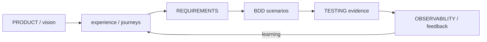

# Quality trace (DocSlime + BDD)

Quality is not a feeling and documentation is not a dump. This house uses a **quality trace**: durable DocSlime docs state the promise; lightweight BDD scenarios make behavior falsifiable; tests, evals, and production observation close the loop. That is how [evidence over vibes](04-evidence-over-vibes.md), [quality regimes](11-quality-regimes.md), and [bugs & debt](12-bugs-and-debt.md) stay connected instead of becoming three parallel religions.

## DocSlime — durable product documentation

[DocSlime](https://www.docslime.dev/) is the companion ecosystem for a product `docs/` tree. Skills: `docslime-init`, `docslime-fill`, `docslime-adr`, `docslime-kiss`. Prefer an existing repo tree; don’t scaffold theater.

**Typical lifecycle** (menu, not mandate — keep only what this repo owns):

| Doc | Role in quality |
| --- | --- |
| `PRODUCT.md` | Why it exists; goals; success metrics — the dish |
| `experience/` | Journeys, opportunities, hypotheses — who feels what |
| `REQUIREMENTS.md` | Testable, solution-neutral build contract |
| `engineering/ARCHITECTURE.md` + `adrs/` | How boundaries and decisions hold |
| `engineering/TESTING.md` | How scenarios map to proof (and known gaps) |
| `engineering/PUBLISHING.md` | How verified artifacts reach users safely |
| `engineering/OBSERVABILITY.md` | How production evidence returns to discovery |

Diátaxis still applies *inside* pages (tutorial / how-to / reference / explanation). **`document-it` is surgical by default** (update the nearest accurate home after a change). Use **DocSlime structures and methods** when product/requirements/testing/decision altitude is actually needed — don’t init or fill a tree just to document today’s fix. Root README/runbooks stay honest entry points. Stale or missing DocSlime docs are [documentation debt](12-bugs-and-debt.md); promises that the system doesn’t keep are **product-framing debt** — still bugs.

## Lightweight BDD — behavior as the contract

[Dan North’s BDD](https://dannorth.net/blog/introducing-bdd/): a story’s behaviour *is* its acceptance criteria. [Given / When / Then](https://martinfowler.com/bliki/GivenWhenThen.html) removes ambiguity so analysts, builders, testers, and (now) agents share one vocabulary.

**House rule:** BDD here means plain-language Given/When/Then **completion scenarios** mapped to expected evidence. It does **not** require Cucumber, `.feature` files, or a new framework unless the repo already uses one. Prefer:

- Issue / plan `BDD Completion Scenarios` (via `issues`)
- DocSlime `REQUIREMENTS.md` + `TESTING.md` behavior coverage table
- Existing tests named/structured as behavior

**Scenario → evidence map** (what “done” means):

| Evidence kind | When it counts |
| --- | --- |
| Automated test (unit / integration / e2e) | Regime A/B oracles; CI gate |
| Eval / dataset score / judge | Regime C generative surfaces |
| Manual / agentic check with notes | Sandboxes, rare paths, honest gaps |
| Doc-only proof | Docs *are* the behavior (runbook accuracy, API reference) |
| Explicit out-of-scope | Scenario retired with owner — not silent drop |

If a scenario has no map, that is **test / proof debt**. If behavior happens but nobody wrote the scenario, that is **understanding / behavior debt**. If PRODUCT or marketing says Then and the system does otherwise, that is a **bug** — framing debt until honesty or reality catches up.

## How regimes use the same trace

| Regime | DocSlime / BDD emphasis |
| --- | --- |
| **A — Deterministic compute** | Requirements + golden/property scenarios; TESTING maps contracts; OBSERVABILITY includes data correctness |
| **B — Interactive product** | experience journeys → scenarios → e2e/a11y/vitals; PRODUCT feeling goals pair with ProductFeeling/Impeccable |
| **C — Generative / high-input** | Scenarios include safety/stop conditions; TESTING includes eval harnesses; OBSERVABILITY includes traces/scores (Langfuse) |

One product may run all three traces on different surfaces. Don’t launder.

## Working rules

1. **Trace before thrash.** When stuck on “is this done?”, walk PRODUCT → requirement → scenario → evidence (`check-readiness`, `test-it`).
2. **Prefer existing definitions.** `fix-it` / `troubleshoot-app` refine DocSlime or issue BDD before inventing a parallel oracle.
3. **Fill for real consumers.** DocSlime fill interviews; don’t invent product facts. Drop template docs that this repo doesn’t own.
4. **Docs that lie are bugs.** Wrong runbooks and ghost requirements hurt developers and agents as much as wrong UI hurts users ([a bug is a bug](12-bugs-and-debt.md)).
5. **Close the loop.** Observation and user/agent feedback should update experience and requirements — not only dashboards.

## Skills

| Move | Skill |
| --- | --- |
| Scaffold / fill / ADR / docs KISS | `docslime-*` |
| Scenario on the issue | `issues` (create / refine / critique) |
| Prove scenarios | `test-it` |
| Gate on evidence | `check-readiness` |
| Match code to docs (surgical; DocSlime when earned) | `document-it` · `docslime-*` |
| Production returns signal | `observe-it` (+ Langfuse when generative) |
| Repair against the contract | `fix-it` / `diagnose-bug` / `troubleshoot-app` |

## Where it shows up

[Evidence over Vibes](04-evidence-over-vibes.md) · [Quality regimes](11-quality-regimes.md) · [Bugs & debt](12-bugs-and-debt.md) · [Vision-Tied Goals](08-vision-tied-goals.md) · practices [DocSlime](../practices/docslime.md) · [Document It](../practices/document-it.md) · [Test It](../practices/test-it.md) · [Check Readiness](../practices/check-readiness.md) · [Issues](../practices/issues.md)

## Further reading

- [Dan North — Introducing BDD](https://dannorth.net/blog/introducing-bdd/) · [What’s in a Story?](https://dannorth.net/blog/whats-in-a-story/)
- [Martin Fowler — GivenWhenThen](https://martinfowler.com/bliki/GivenWhenThen.html)
- [Diátaxis](https://diataxis.fr/) · [Write the Docs](https://www.writethedocs.org/guide/)
- [DocSlime](https://www.docslime.dev/) — companion docs lifecycle
- [Cucumber — Gherkin reference](https://cucumber.io/docs/gherkin/reference/) — syntax when the repo already automates GWT
