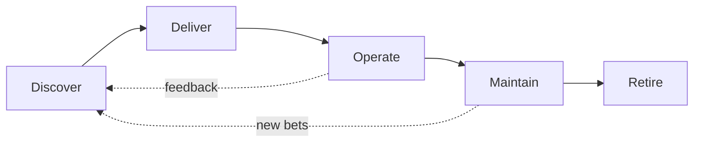

# How work flows

Software has a life. This part is the **spine** of the handbook — not a bag of skills. Phases use industry-standard names so we aren’t inventing a private taxonomy.

**Discover → Deliver → Operate → Maintain → Retire**

| Phase | Question | Start here |
| --- | --- | --- |
| [Discover](01-discover.md) | What should we learn before (and while) building? | Continuous discovery, fidelity, spec altitude |
| [Deliver](02-deliver.md) | How do we build, integrate, and put it into service? | Merge / stage / ship; open [Architecture](../architecture/index.md) when bets are unclear |
| [Operate](03-operate.md) | How do we keep it alive and learn from production? | Ops, observability, feedback |
| [Maintain](04-maintain.md) | How do we change it without boiling the ocean? | Refactor, update, simplify, buy/vendor/OSS, LLM-era cost |
| [Retire](05-retire.md) | How do we leave without losing the lessons? | Deprecate, transition, archive |

When shape, language, framework, or placement is undecided, stop coding theater and open **[Architecture](../architecture/index.md)**.

## Grounding (canonical cousins)

| Handbook phase | Authoritative cousins |
| --- | --- |
| Discover | Continuous discovery / dual-track; ISO/IEC/IEEE 12207 stakeholder needs & requirements |
| Deliver | DevOps Develop + Deliver; 12207 implementation, integration, V&V; ITIL **Transition** into service |
| Operate | 12207 / ITIL **Operation**; SRE / observability |
| Maintain | 12207 **Maintenance**; continual improvement; buy-vs-build |
| Retire | 12207 **Disposal** + **Transition** (cutover); archive / ADR so knowledge survives |

Full bibliography: [Sources](../sources.md).
