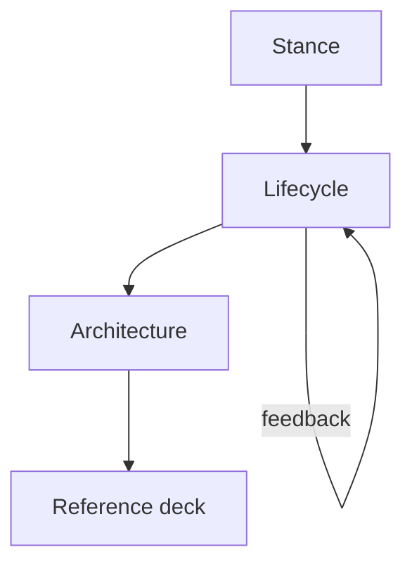

# The 'This is Fine' Guide to Building Software

*The room is on fire. You have coffee. Build anyway — on purpose.*

## What’s Inside

**1. Stance**

- [Why it Works](why-it-works.md)
- [Orientation](orientation/index.md)

**2. Lifecycle — how work flows**

[Discover → Deliver → Operate → Maintain → Retire](flow/index.md)

- [Discover](flow/01-discover.md) — discovery, fidelity, spec altitude
- [Deliver](flow/02-deliver.md) — build, integrate, ship plays
- [Operate](flow/03-operate.md) — ops, observability, feedback
- [Maintain](flow/04-maintain.md) — refactor, buy/vendor, LLM-era cost
- [Retire](flow/05-retire.md) — deprecate, transition, archive

**3. Architecture — when you need a bet**

[Architecture hub](architecture/index.md) — shape → language → framework → [what runs where](architecture/what-runs-where.md) → [compute hosts](paths/compute/index.md)

- [Project shapes](paths/index.md) — website → CLI → package → monorepo
- [Language selection](concepts/09-language-selection.md)
- [Web framework selection](concepts/10-web-framework-selection.md)
- [Quality regimes](concepts/11-quality-regimes.md) · [Bugs & debt](concepts/12-bugs-and-debt.md) · [Quality trace](concepts/13-quality-trace.md)

**4. Reference deck** (draw cards as the flow or shape says)

- [Strategies](strategies/index.md)
- [Practices (TTPs)](practices/index.md)
- [Concepts (deep dives)](concepts/index.md)
- [Sources & grounding](sources.md)
- [Continue learning](continue-learning.md)

## Introduction

Software is always somewhat on fire: half-finished branches, flaky CI, a prod mystery, an agent rewriting the same file, a vision nobody wrote down. The meme is not denial. **This is fine** means *I will not add more fire while I drink this coffee.* You survey the room, name what’s burning, pick one achievable move that serves why the project exists, then act with a named skill — not vibes, not a bigger swarm.

This handbook is the field guide for that stance. It sits on the [DecisionNerd/dev-skills](https://github.com/DecisionNerd/dev-skills) pack and points outward to DocSlime, ProductFeeling, Impeccable, and whatever is vendored in your repo. The skills are the named cuts; the vision is the dish; evidence is how you taste as you go — [quality regimes](concepts/11-quality-regimes.md) say which tasting method fits, and the [quality trace](concepts/13-quality-trace.md) keeps documentation and proof on the same plate.

**New here?** Read [How work flows](flow/index.md), then open [Architecture](architecture/index.md) only when shape/stack/placement is the fire. Don’t alphabetize the practice deck on day one.

## How to use this handbook

### One reading order

1. **Orient** — [Why it Works](why-it-works.md) + [Orientation](orientation/index.md) (coffee, not panic).
2. **Lifecycle** — [Discover → … → Retire](flow/index.md). Know where you are in the life of the system.
3. **Architecture** — [Architecture](architecture/index.md) when you must choose shape, language, framework, placement, or host.
4. **Reference** — strategies / practices / skills as a modular deck; the flow and shape pages say which cards to draw.

### Skills quick map (when you have DecisionNerd skills)

| To… | Run |
|------|-----|
| Don’t know what to do next | `idk-now` / `idk-now quick` |
| “Is this overcomplicated?” | `kiss` |
| Repo / CI / ESC secrets | `repos` |
| Tactical scout | `recon` / `recon issue` |
| Track work | `issues` · `milestones` · `pulls` |
| Diagnose / repair | `troubleshoot-app` · `diagnose-bug` · `fix-it` |
| Harden | `test-it` · `observe-it` · `document-it` · `research-it` · `refactor-it` |
| Ship | `check-readiness` · `merge-it` · `stage-it` · `ship-it` |
| Agent thrash | `agents slap` |
| Clutter | `tidy-up scan` |
| Companions | ProductFeeling · Impeccable · DocSlime |

### The coffee test

Before spawning another agent or opening another PR: *Does this put out a real fire, or just rearrange the smoke?* If you can’t answer, run [Orientation](orientation/index.md) or `idk-now` — don’t pour accelerant. If you’re loading monorepo/K8s tools onto a simple website, run `kiss` first.
