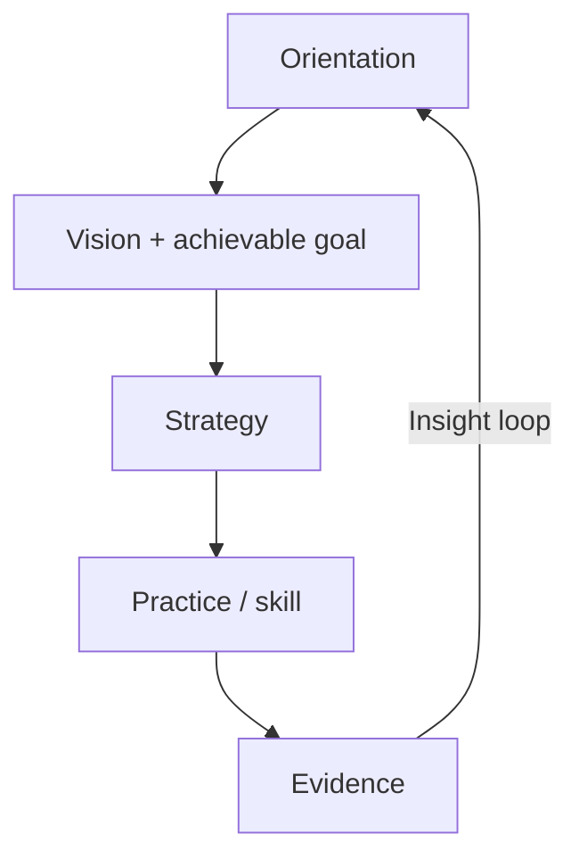

# The 'This is Fine' Guide to Building Software

*The room is on fire. You have coffee. Build anyway — on purpose.*

## What’s Inside

**Welcome & Setup** (this page)

- [Introduction](#introduction)
- [How to use this handbook](#how-to-use-this-handbook)

**[Why it Works](why-it-works.md)** — why panic shipping and agent thrash lose to calm, named moves.

**[Orientation](orientation/index.md)** — the prerequisite: why the project exists, what’s actually burning, and which skills are in the room.

**[Strategies](strategies/index.md)** — seven strategies that combine practices toward a building goal.

**[Practices (TTPs)](practices/index.md)** — modular Tools, Techniques, and Practices you can combine, remix, or ignore — each mapped to agent skills.

**[Concepts (deep dives)](concepts/index.md)** — the ideas the rest of the handbook builds on.

**[Continue learning](continue-learning.md)** — companions and durable sources beyond this guide.

## Introduction

Software is always somewhat on fire: half-finished branches, flaky CI, a prod mystery, an agent rewriting the same file, a vision nobody wrote down. The meme is not denial. **This is fine** means *I will not add more fire while I drink this coffee.* You survey the room, name what’s burning, pick one achievable move that serves why the project exists, then act with a named skill — not vibes, not a bigger swarm.

This handbook is the field guide for that stance. It sits on the [DecisionNerd/dev-skills](https://github.com/DecisionNerd/dev-skills) pack and points outward to DocSlime, ProductFeeling, Impeccable, and whatever is vendored in your repo. The skills are the named cuts; the vision is the dish; evidence is how you taste as you go.

## How to use this handbook

Combine, remix, ignore. Modular on purpose. Two paths share the same spine:

- **With the skills** — an agent runs the playbooks via commands (`idk-now`, `recon`, `fix-it`, …). Fastest path; load only the pages you need.
- **Text only** — read and apply by hand. No tooling required.

### Path A — With DecisionNerd skills

| To… | Run |
|------|-----|
| Don’t know what to do next | `idk-now` / `idk-now quick` |
| Repo split / CI / ESC secrets | `repos` |
| Tactical scout of git/issue/milestone | `recon` / `recon issue` / `recon repo` |
| Track work | `issues` · `milestones` · `pulls` |
| Repos | `repos status` · `split` · `combine` · `monorepo` · `ci` · `secrets` |
| Diagnose / repair | `troubleshoot-app` · `diagnose-bug` · `fix-it` |
| Harden | `kiss` · `test-it` · `observe-it` · `document-it` · `research-it` · `refactor-it` |
| Ship | `check-readiness` · `merge-it` · `stage-it` · `ship-it` |
| Agent thrash / drain | `agents slap` |
| Disk / worktree clutter | `tidy-up scan` |
| Feeling / craft / docs companions | ProductFeeling · Impeccable · DocSlime |

### Path B — Text only

1. [Orient](orientation/index.md): vision, situation, skill universe.
2. Pick a [strategy](strategies/index.md) that matches the goal.
3. Draw the [practices](practices/index.md) it names; open [concepts](concepts/index.md) when a mechanism is fuzzy.
4. Apply one practice; collect evidence; loop.

### The coffee test

Before spawning another agent or opening another PR: *Does this put out a real fire, or just rearrange the smoke?* If you can’t answer, run [Orientation](orientation/index.md) or `idk-now` — don’t pour accelerant.
