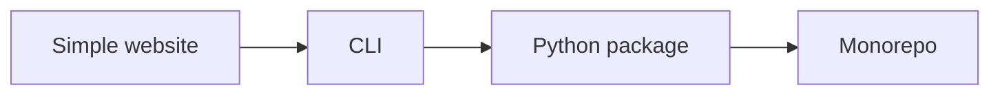
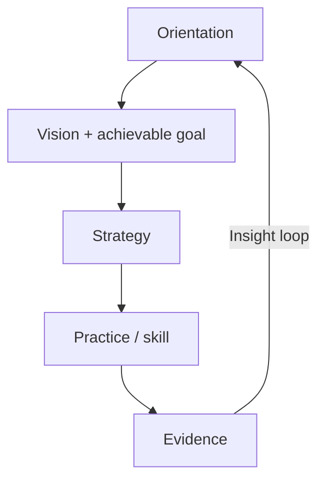

# The 'This is Fine' Guide to Building Software

*The room is on fire. You have coffee. Build anyway — on purpose.*

## What’s Inside

**Start here — by project shape & compute**

1. [Project paths](paths/index.md) — how to read this book as you grow
2. [Language selection](concepts/09-language-selection.md) — Python, TypeScript/Node, Rust (Kotlin / Swift / Godot when earned)
3. [Web framework selection](concepts/10-web-framework-selection.md) — React + Next.js on Vercel; Astro Starlight for docs
4. [Quality regimes](concepts/11-quality-regimes.md) — compute ≠ product UX ≠ generative/evals
5. [Bugs & debt](concepts/12-bugs-and-debt.md) — a bug is a bug; debt types
6. [Quality trace](concepts/13-quality-trace.md) — DocSlime + lightweight BDD
7. [Path 01 — Simple website](paths/01-simple-website.md)
8. [Path 02 — CLI](paths/02-cli.md)
9. [Path 03 — Python package](paths/03-python-package.md)
10. [Path 04 — Multi-language monorepo](paths/04-monorepo.md)
11. [Compute deployments](paths/compute/index.md) — serverless, Docker, Kubernetes, Vercel, Cloudflare, AWS/GCP/Fly

**Reference deck** (draw cards as the path says)

- [Why it Works](why-it-works.md)
- [Orientation](orientation/index.md)
- [Strategies](strategies/index.md)
- [Practices (TTPs)](practices/index.md)
- [Concepts (deep dives)](concepts/index.md)
- [Sources & grounding](sources.md)
- [Continue learning](continue-learning.md)

## Introduction

Software is always somewhat on fire: half-finished branches, flaky CI, a prod mystery, an agent rewriting the same file, a vision nobody wrote down. The meme is not denial. **This is fine** means *I will not add more fire while I drink this coffee.* You survey the room, name what’s burning, pick one achievable move that serves why the project exists, then act with a named skill — not vibes, not a bigger swarm.

This handbook is the field guide for that stance. It sits on the [DecisionNerd/dev-skills](https://github.com/DecisionNerd/dev-skills) pack and points outward to DocSlime, ProductFeeling, Impeccable, and whatever is vendored in your repo. The skills are the named cuts; the vision is the dish; evidence is how you taste as you go — [quality regimes](concepts/11-quality-regimes.md) say which tasting method fits, and the [quality trace](concepts/13-quality-trace.md) (DocSlime + BDD) keeps documentation and proof on the same plate.

**New here?** Don’t alphabetize the practice deck. Pick a [project path](paths/index.md) and follow its reading order. A first website should not open with monorepo ESC secrets; a monorepo should not pretend it’s still a single static page.

## How to use this handbook

### Path C — Progressive projects (recommended)

Also pick **where it runs** when you have a deploy unit: [Compute](paths/compute/index.md).

1. Open [Project paths](paths/index.md) and choose the shape you are actually building.
2. Do that path’s **reading order** and **starter DAG**.
3. Graduate only when the path’s criteria say so — or when `kiss` says complexity is earned.
4. Use strategies/practices as a modular deck; the path tells you which cards to draw first.

### Path A — With DecisionNerd skills

| To… | Run |
|------|-----|
| Don’t know what to do next | `idk-now` / `idk-now quick` |
| “Is this overcomplicated?” | `kiss` |
| Repo / CI / ESC secrets | `repos` |
| Tactical scout | `recon` / `recon issue` |
| Track work | `issues` · `milestones` · `pulls` |
| Diagnose / repair | `troubleshoot-app` · `diagnose-bug` · `fix-it` |
| Harden | `test-it` · `observe-it` · `document-it` · `research-it` · `refactor-it` |
| Ship | `check-readiness` · `merge-it` · `stage-it` · `ship-it` |
| Agent thrash | `agents slap` |
| Clutter | `tidy-up scan` |
| Companions | ProductFeeling · Impeccable · DocSlime |

### Path B — Text only / modular deck

1. [Orient](orientation/index.md).
2. Pick a [strategy](strategies/index.md).
3. Draw [practices](practices/index.md); open [concepts](concepts/index.md) for mechanisms.
4. Apply; collect evidence; loop.

### The coffee test

Before spawning another agent or opening another PR: *Does this put out a real fire, or just rearrange the smoke?* If you can’t answer, run [Orientation](orientation/index.md) or `idk-now` — don’t pour accelerant. If you’re loading monorepo/K8s tools onto a simple website, run `kiss` first.
