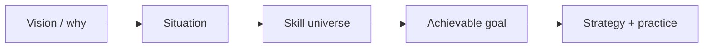

# Orientation

When the room is on fire, **look before you pour**. Orientation is the prerequisite for every strategy in this handbook: recover *why the project exists*, name *what’s actually burning*, and inventory *which skills are already in the room*.

Skip orientation and you get productive-looking motion that doesn’t serve the vision — agent thrash, tidy PRs for the wrong product, docs that describe a ghost.

## Pages

- [Vision and Why](01-vision-and-why.md) — the dish you’re cooking; confidence low/med/high
- [Situation Assessment](02-situation-assessment.md) — env, repo, git, what’s on fire vs smoke
- [Skill Universe](03-skill-universe.md) — DecisionNerd pack + DocSlime + ProductFeeling + Impeccable + vendored

Also decide [language](../concepts/09-language-selection.md) early (Python / TypeScript / Rust; Kotlin, Swift, Godot only when the platform requires it). For web, decide [framework](../concepts/10-web-framework-selection.md) (Next/React on Vercel vs Starlight for docs).

## Fast path

Run **`idk-now`** (full) or **`idk-now quick`**. For tactical git/issue scope only, use **`recon`** — but if you’re *lost*, prefer `idk-now`.

Then pick a [project path](../paths/index.md) (website → CLI → monorepo) so you don’t load every practice at once.

## Agent skill

| To… | Run |
|------|-----|
| Full orient + questions + next step | `idk-now` |
| Short pass | `idk-now quick` |
| Vision-only | `idk-now vision` |
| List skills on hand | `idk-now skills` |
| Tactical scout (not lost) | `recon` / `recon repo` / `recon issue` |
