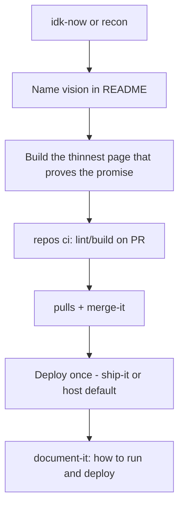

# Path 01 — Simple website

Your first (or next) **simple website**: one app, one primary language/stack, one deploy target, a README that tells the truth. The room may still be on fire — keep the coffee and refuse machinery you don’t need.

## What “simple website” means here

- Marketing site, docs site, small product UI, or personal project on Pages/Vercel/Netlify/etc.
- One repo (or one obvious package). Not a polyglot monorepo.
- Success = a visitor can load the page and you can ship a change without heroics.

## What to ignore (for now)

| Skip | Why |
| --- | --- |
| Monorepo tooling, affected graphs | One deployable — `kiss` says keep it |
| Multi-env promote theater | One target is enough; add staging when pain is real |
| Agent swarms / subagents | One writer; parent stays in charge |
| Heavy observability platforms | A working deploy + basic errors first |
| Org-wide ESC sprawl | One site’s secrets can wait until CI needs cloud keys |

If you’re reaching for those, either you graduated early — jump to [Path 04](04-monorepo.md) — or you’re rearranging smoke. Run `kiss audit`.

## Reading order

1. Language: [Language selection](../concepts/09-language-selection.md) (usually TypeScript for web)
2. Framework: [Web framework selection](../concepts/10-web-framework-selection.md) — Next/React on Vercel for apps; Starlight for docs
3. Concepts: [This is Fine](../concepts/01-this-is-fine-stance.md) · [Smallest Next Step](../concepts/03-smallest-next-step.md) · [Vision-Tied Goals](../concepts/08-vision-tied-goals.md) · [Evidence over Vibes](../concepts/04-evidence-over-vibes.md)
4. Orientation: [Vision](../orientation/01-vision-and-why.md) · [Situation](../orientation/02-situation-assessment.md)
5. Strategies: [Orient](../strategies/01-orient.md) → [Craft and Harden](../strategies/04-craft-and-harden.md) → [Ship](../strategies/05-ship.md) (light) → [Tidy](../strategies/07-tidy-and-recover.md) as needed
6. Practices (draw these first): [IDK Now](../practices/idk-now.md) · [KISS](../practices/kiss.md) · [Repos](../practices/repos.md) (`status`, thin `ci`) · [Impeccable](../practices/impeccable.md) · [Document It](../practices/document-it.md) · [Pulls](../practices/pulls.md) · [Merge It](../practices/merge-it.md) / [Ship It](../practices/ship-it.md) · [Tidy Up](../practices/tidy-up.md)

Companion: **Impeccable** for UI craft; **DocSlime** only if you want a tiny `docs/PRODUCT.md` — don’t scaffold the whole product org tree.

## Starter DAG

Right-sized tasks (Goldilocks):

1. One sentence: who is this site for and what should they feel/do.
2. One vertical slice live (hero + real content, not a component zoo).
3. CI that fails on broken build.
4. A merge path you trust.
5. README: install, run, deploy.

## Skills cheat sheet

| Moment | Skill |
| --- | --- |
| Lost | `idk-now` |
| “Is this too much?” | `kiss` |
| Repo/CI basics | `repos status` · `repos ci` |
| UI craft | Impeccable |
| Docs | `document-it` |
| Land the change | `pulls` · `merge-it` · `ship-it` |
| Agent thrash | `agents slap` then stop |

## Graduate when

- You need a **second installable artifact** (CLI) → [Path 02](02-cli.md)
- You need a **Python library** others import → [Path 03](03-python-package.md)
- You need **multiple apps/packages or deploy targets** with shared code → [Path 04](04-monorepo.md)
- You need a specific **runtime host** (Lambda, Fly, Vercel, …) → [Compute](compute/index.md)
- Staging vs prod gates are saving you from real incidents → keep ship/stage; still not automatically a monorepo

## Follow-Up Prompt

Want to run `idk-now quick` on this website repo, or `kiss` on the current plan before writing code?
