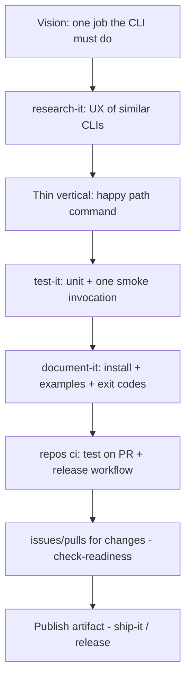

# Path 02 — CLI

A **command-line tool**: users install it, run it, and trust exit codes and help text. Still prefer **one primary artifact** and one repo unless shared libraries are already forcing your hand.

Assumes you can already ship a thin change ([Path 01](01-simple-website.md) habits). Add DX, tests, and packaging — not a platform.

## What “CLI” means here

- `npx`, Homebrew, cargo, pipx, go install, or a binary release
- Interface = flags, subcommands, stdin/stdout/stderr, docs in `--help` + README
- Success = a stranger completes the primary job once without a Zoom call

## What to ignore (for now)

| Skip | Why |
| --- | --- |
| Multi-service mesh / many deploy targets | One CLI binary or package |
| Fancy agent crews for every fix | Clear done-when + tests beat swarm |
| Full product strategy tree | Thin PRODUCT/README; DocSlime only if multi-audience |
| Monorepo “just in case” | Extract packages when duplication hurts — `kiss` / `repos monorepo` |

## Reading order

1. Lifecycle: [How work flows](../flow/index.md) — usually [Deliver](../flow/02-deliver.md) / [Operate](../flow/03-operate.md)
2. Architecture: [Architecture](../architecture/index.md) · [Language](../concepts/09-language-selection.md)
3. Concepts: prior shape + [Stop Conditions](../concepts/07-stop-conditions.md) · [Work Ownership](../concepts/06-work-ownership.md) · [Skills as Named Cuts](../concepts/02-skills-as-named-cuts.md)
4. Strategies: [Orient](../strategies/01-orient.md) · [Track Work](../strategies/02-track-work.md) · [Diagnose and Fix](../strategies/03-diagnose-and-fix.md) · [Craft and Harden](../strategies/04-craft-and-harden.md) · [Ship](../strategies/05-ship.md)
5. Practices to emphasize: [Test It](../practices/test-it.md) · [Research It](../practices/research-it.md) · [Issues](../practices/issues.md) · [Recon Issue](../practices/recon-issue.md) · [Check Readiness](../practices/check-readiness.md) · [Repos](../practices/repos.md) (`ci harden` lightly) · [Document It](../practices/document-it.md) · [Observe It](../practices/observe-it.md) only for crash/telemetry you will actually read

Agent experience matters: treat the CLI as something **coding agents** will invoke — clear help, stable flags, non-zero on failure ([experience](../orientation/index.md) mindset; DocSlime `experience/` if you keep docs).

## Starter DAG

Right-sized tasks:

1. Name the **one job** and non-goals (what it will never do).
2. Implement the happy-path command with real `--help`.
3. Tests that fail when the job regresses.
4. Install instructions a cold reader can follow.
5. CI + a release you can repeat.

## Skills cheat sheet

| Moment | Skill |
| --- | --- |
| Design the interface | `research-it` · `kiss` |
| Prove behavior | `test-it` · `check-readiness` |
| Bugs | `diagnose-bug` · `fix-it` |
| Packaging/CI | `repos ci` · `repos ci harden` |
| Track work | `issues` · `pulls` · `merge-it` |
| Lost | `idk-now` |

## Graduate when

- Importable **Python package** as the product → [Path 03](03-python-package.md)
- Companion **compute** host → [Compute](compute/index.md)
- Multiple binaries/packages, shared libs across languages, or **several deploy targets** (APIs, workers, sites) → [Path 04](04-monorepo.md)
- The CLI is only a thin client of a larger system already in a monorepo — join Path 04 instead of pretending it’s still “just a CLI”

## Follow-Up Prompt

Want `kiss` on the proposed subcommand surface, or `recon issue` for the first vertical slice?
