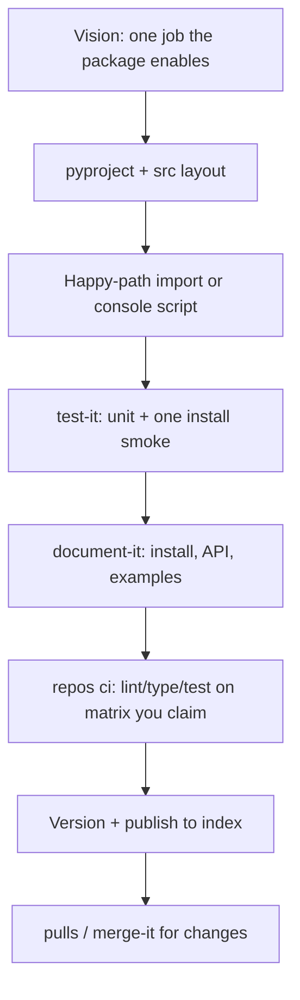

# Path 03 — Python package

A **Python package** others (or future-you) install: library on PyPI/private index, importable module, optional console scripts. One primary artifact — not a polyglot monorepo unless shared code already forces it.

Assumes [Path 01](01-simple-website.md) / [Path 02](02-cli.md) habits: vision, tests, honest docs, CI that means something. A CLI implemented *in* Python can sit on Path 02; use **this** path when the main product is the **importable package** (with or without entry points).

## What “Python package” means here

- `pyproject.toml` (preferred) defining name, deps, optional extras, build backend
- Install via `pip` / `uv` / `poetry` / private index; versioned releases
- Success = a cold developer `pip install`s (or `uv add`s) and completes the primary job via import or console script

## What to ignore (for now)

| Skip | Why |
| --- | --- |
| Multi-service deploy mesh | Packages are published, not “deployed” like apps — see [Compute](compute/index.md) only if you also ship a service |
| Monorepo “just in case” | One package first; extract when duplication hurts (`kiss` / `repos monorepo`) |
| Supporting every Python forever | Declare `requires-python`; test the matrix you claim |
| Agent swarms for packaging | One writer; clear done-when |

## Reading order

1. Confirm [language defaults](../concepts/09-language-selection.md) (Python is already the pick).
2. Concepts: [Smallest Next Step](../concepts/03-smallest-next-step.md) · [Evidence over Vibes](../concepts/04-evidence-over-vibes.md) · [Stop Conditions](../concepts/07-stop-conditions.md) · [Vision-Tied Goals](../concepts/08-vision-tied-goals.md)
3. Strategies: [Orient](../strategies/01-orient.md) · [Track Work](../strategies/02-track-work.md) · [Craft and Harden](../strategies/04-craft-and-harden.md) · [Ship](../strategies/05-ship.md) · [Diagnose and Fix](../strategies/03-diagnose-and-fix.md) when imports break
4. Practices: [Research It](../practices/research-it.md) · [Test It](../practices/test-it.md) · [KISS](../practices/kiss.md) · [Document It](../practices/document-it.md) · [Repos](../practices/repos.md) (`ci`, release workflow) · [Check Readiness](../practices/check-readiness.md) · [Issues](../practices/issues.md) / [Pulls](../practices/pulls.md) · [Merge It](../practices/merge-it.md)

Treat **agents and other packages** as users: stable public API, typed where it helps, no surprise side effects on import.

## Starter DAG

Right-sized tasks:

1. Name the public API surface and non-goals.
2. `src/` layout + build backend that others can install from git/PyPI.
3. Tests that fail when the API regresses; optional console script smoke.
4. README: install, minimal example, versioning policy.
5. CI + a repeatable release (tag → build → publish).

## Skills cheat sheet

| Moment | Skill |
| --- | --- |
| API / packaging choices | `research-it` · `kiss` |
| Prove behavior | `test-it` · `check-readiness` |
| Docs / examples | `document-it` |
| CI / trusted publishing | `repos ci` · `repos ci harden` · `repos secrets` if OIDC to PyPI |
| Bugs | `diagnose-bug` · `fix-it` |
| Lost | `idk-now` |

## Graduate when

- The package is one of many shared libs / apps → [Path 04 — Monorepo](04-monorepo.md)
- You also run long-lived or serverless **compute** beside the library → [Compute deployments](compute/index.md)
- A thin CLI is the main UX → prefer [Path 02](02-cli.md) and keep the library internal or dual-published deliberately

## Follow-Up Prompt

Want `kiss` on the public API surface, or `repos ci` for a first test+publish workflow?
