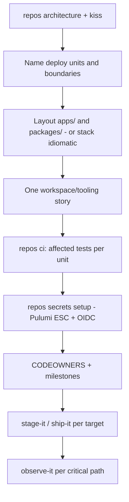

# Path 04 — Multi-language monorepo

A **monorepo** with multiple packages and/or languages and **multiple deployment targets**. Complexity is often earned here — and often faked. Start with [KISS](../practices/kiss.md) and [Repos](../practices/repos.md) `architecture` / `monorepo` before importing the world.

Assumes Path 01–03 habits (website, CLI, and/or Python package): vision, thin verticals, tests, honest docs, CI that means something.

## What this path means

- Apps + packages (or services) in one repo; possibly Node + Go + Python + IaC, etc.
- More than one thing you deploy (web, API, worker, CLI, infra stacks)
- Shared ownership needs CODEOWNERS, boundaries, and an **affected** CI story
- Secrets and envs are dangerous if copied as long-lived GitHub Secrets → **Pulumi ESC by default** (`repos secrets`)

## What “simple” still means

Simple is not “few files.” Simple is:

- A **DAG** you can explain: change → affected tests → deploy unit(s)
- Right-sized tasks (not 40 micro-PRs, not one mega-PR)
- Earned gates kept; theater removed (`repos ci simplify` + `kiss`)

## Reading order

1. Orientation + [Skill Universe](../orientation/03-skill-universe.md)
2. Concepts: [Agent Agency](../concepts/05-agent-agency.md) · [Stop Conditions](../concepts/07-stop-conditions.md) · [Work Ownership](../concepts/06-work-ownership.md) · all prior concepts
3. Strategies: full set, especially [Track Work](../strategies/02-track-work.md) · [Ship](../strategies/05-ship.md) · [Agent Hygiene](../strategies/06-agent-hygiene.md) · [Diagnose and Fix](../strategies/03-diagnose-and-fix.md)
4. Practices to emphasize: [Repos](../practices/repos.md) · [KISS](../practices/kiss.md) · [Milestones](../practices/milestones.md) · [Stage It](../practices/stage-it.md) · [Ship It](../practices/ship-it.md) · [Observe It](../practices/observe-it.md) · [Sub-Agents](../practices/sub-agents.md) (explore only) · [Agent Slap](../practices/agent-slap.md) · [Tidy Up](../practices/tidy-up.md)

Companions: DocSlime for real product docs when multiple audiences exist; ProductFeeling/Impeccable for user-facing surfaces inside the monorepo.

## Starter DAG (migration or greenfield)

Right-sized tasks:

1. List **deploy units** and who owns each.
2. Draw allowed dependency direction (who may import whom).
3. Get **one** unit green in CI with affected scope.
4. Put secrets in ESC; delete static cloud keys when safe.
5. Promote path per target (staging → prod where policy exists).

## Skills cheat sheet

| Moment | Skill |
| --- | --- |
| Should we even monorepo? | `kiss` · `repos architecture` · `repos monorepo` |
| Split/combine history | `repos split` · `repos combine` |
| CI | `repos ci` · `harden` · `simplify` |
| Secrets | `repos secrets setup` (ESC default) |
| Cross-cutting work | `milestones` · `issues` · `recon issue` |
| Parallel explore | `agents sub` (no overlapping writers) |
| Thrash | `agents slap` |
| Promote | `stage-it` · `ship-it` |
| Clutter after filters | `tidy-up` |

## Anti-patterns

- Monorepo as fashion with one tiny app inside
- “Test everything always” CI with no affected graph (unless earned)
- Two agents writing the same package
- Long-lived cloud keys in GitHub Secrets after ESC works
- Shipping all targets because one package changed

## Compute targets

Where units *run* is a separate choice — see [Compute deployments](compute/index.md) (serverless, Docker, Kubernetes, Vercel, Cloudflare, AWS/GCP/Fly).

## Graduate / revisit

There is no Path 05 in this handbook. When the org outgrows one monorepo, use `repos split` with a consumer plan — don’t panic-fork. Loop back to Path 01/02 habits inside each deploy unit so packages stay shippable alone.

## Follow-Up Prompt

Want `repos architecture` on the current tree, or `kiss` on “do we need a monorepo at all?”
