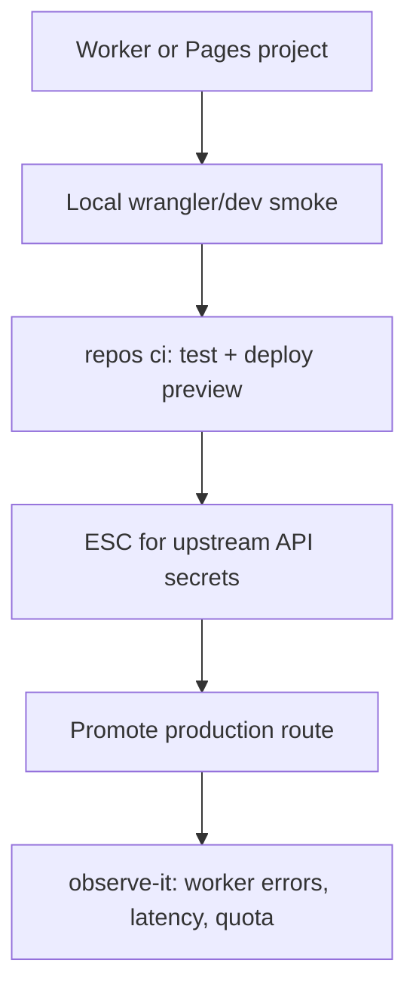

# Compute — Cloudflare

**Cloudflare**: Pages, Workers, durable objects/KV/R2 as needed — edge-first compute and static hosting.

## Fit

- Global latency, edge logic, static+API at the rim
- Workers-sized workloads (CPU/memory/time limits OK)
- Overlap with [Serverless](serverless.md); choose Cloudflare when edge network *is* the product constraint

## Skip when

- Long jobs, heavyweight native deps, or regional data residency that forces a classic cloud region — [Clouds](clouds.md) / [Docker](docker.md)

## Starter DAG

## Skills

`repos ci` · `repos secrets` · `test-it` · `observe-it` · `kiss` · `document-it` (limits & binding names)

## Watchouts

- Ignoring isolate CPU limits until prod
- Mixing Pages and three Workers with no ownership map
- Duplicating the same site on Vercel *and* Cloudflare without a reason
