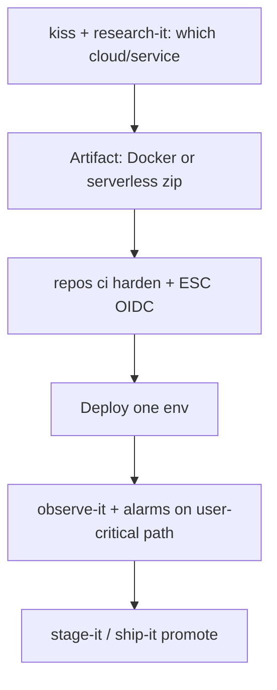

# Compute — Clouds (AWS, GCP, Fly.io)

**Managed clouds / PaaS**: run deploy units on AWS, Google Cloud, or Fly.io (and similar) without assuming a full Kubernetes estate.

Use this page for **IaaS/PaaS choices**; pair with [Docker](docker.md) or [Serverless](serverless.md) for the artifact shape.

## Fit by provider (sketch)

| Provider | Often fits |
| --- | --- |
| **AWS** | Broad managed services (ECS/Fargate, Lambda, RDS, etc.); enterprise already on AWS |
| **GCP** | Cloud Run, GKE when earned, data/ML adjacency |
| **Fly.io** | Simple regional containers close to users; fast path from Docker |

Exact services change — decide from **constraints** (region, compliance, team skill), then `research-it`.

## Shared stance

- **Pulumi ESC + OIDC** for CI and runtime creds (`repos secrets setup`) — default over static access keys
- One region/blast radius per unit until multi-region is earned
- Prefer managed runtimes (Cloud Run, ECS Fargate, Fly machines) before self-managed k8s nodes

## Starter DAG

## Skills

`research-it` · `kiss` · `repos architecture` · `repos ci harden` · `repos secrets` · `observe-it` · `stage-it` · `ship-it` · `diagnose-bug` / `troubleshoot-app`

## Watchouts

- Multi-cloud “for portability” with no customer need
- Long-lived admin keys in GitHub Secrets
- Every monorepo package getting its own orphan AWS account without ownership
