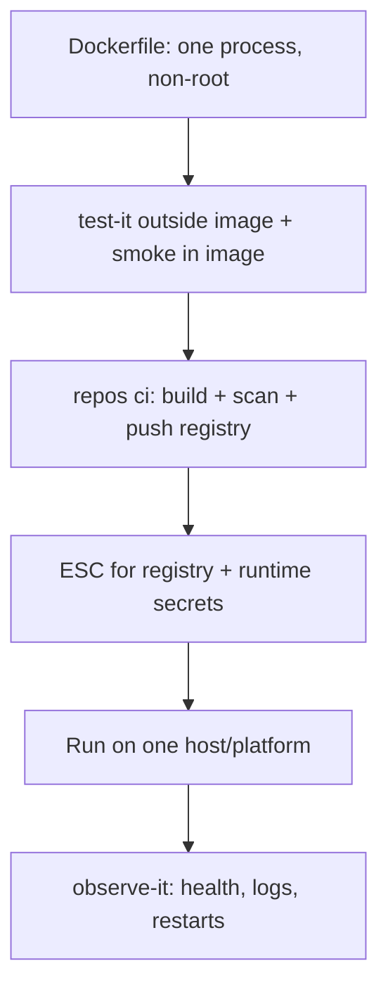

# Compute — Docker

**Docker** (or OCI images): one portable process image from laptop → CI → any host that runs containers (Fly, Cloud Run, ECS, raw VM, k8s).

## Fit

- Same runtime locally and in prod matters
- You’re not ready for k8s, but need more than a pure function
- Multi-language monorepo deploy units each get an image ([Path 04](../04-monorepo.md))

## Skip when

- Static site only — [Vercel](vercel.md) / [Cloudflare](cloudflare.md) / Pages may be enough
- You need full cluster scheduling tomorrow *and* have the ops — [Kubernetes](kubernetes.md)

## Starter DAG

## Skills

`repos ci harden` · `repos secrets` · `test-it` · `kiss` (one image per unit) · `tidy-up` (prune dangling images/build cache) · `ship-it` / `stage-it`

## Watchouts

- Fat images and “latest” tags without digests in prod
- Secrets in image layers
- Divergent Compose vs prod without a smoke test
