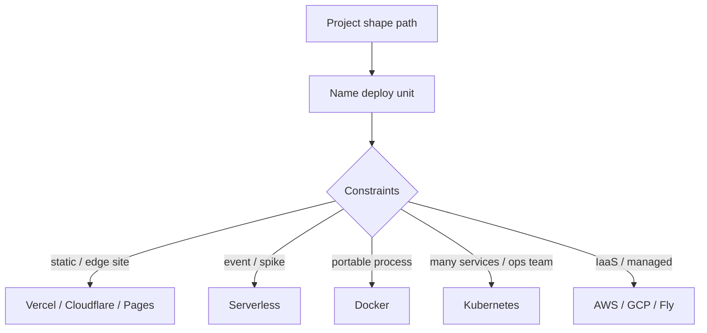

# Compute deployments

**Project shape** (website, CLI, Python package, monorepo) answers *what you build*.  
**Compute** answers *where a runnable unit executes*.

Pick a target because constraints demand it — not because it’s fashionable. Pair with `kiss` and `repos architecture` before adding a second cloud.

## Choose a target

| Path | Fit when… | Default stance |
| --- | --- | --- |
| [Serverless](serverless.md) | Event-driven, spiky, short work, managed scale | Least ops; watch cold start & limits |
| [Docker](docker.md) | Same artifact local → CI → host | Portable process; one image per unit |
| [Kubernetes](kubernetes.md) | Many services, real ops capacity | Earned complexity only |
| [Vercel](vercel.md) | Frontend / Next-style app, preview deploys | Ship UI fast; don’t force backends here |
| [Cloudflare](cloudflare.md) | Edge, Workers, static+KV/R2 | Latency & global; respect isolate limits |
| [Clouds — AWS, GCP, Fly.io](clouds.md) | Managed IaaS/PaaS mix | ESC secrets; explicit regions & blast radius |

## Shared rules (every compute path)

1. **One deploy unit** with a done-when and owner ([Work Ownership](../../concepts/06-work-ownership.md)).
2. **Secrets via Pulumi ESC + OIDC by default** — `repos secrets setup` ([Repos](../../practices/repos.md)); no long-lived cloud keys in GitHub if ESC works.
3. **CI proves the artifact** before promote — `repos ci` · `test-it` · `check-readiness` · `stage-it` / `ship-it` as policy allows.
4. **Observe what you ship** — `observe-it` for the critical path; don’t invent a full APM estate on day one.
5. **`kiss` before a second platform** — multi-cloud is usually smoke unless constraints are real.

## Reading order

1. Finish (or skim) your [project shape](../index.md).
2. Open the compute page that matches constraints.
3. Draw: [KISS](../../practices/kiss.md) · [Repos](../../practices/repos.md) · [Ship](../../strategies/05-ship.md) · [Observe It](../../practices/observe-it.md) · [Agent Slap](../../practices/agent-slap.md) if deploy agents thrash.

## Anti-patterns

- “Kubernetes for a single static site”
- Copy-pasting cloud keys into GitHub Secrets after ESC is available
- Deploying every monorepo package because one library changed
- Three hosts (Vercel + Fly + raw EC2) with no ownership map
