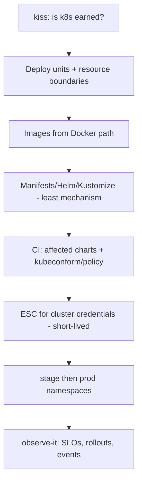

# Compute — Kubernetes

**Kubernetes**: orchestrate many containerized services — scheduling, rollout, service discovery, when **ops capacity** and service count make it earned.

## Fit

- Multiple services, independent scale, real platform team (or strong desire + time to learn)
- You already have [Docker](docker.md) discipline per unit

## Skip when

- Single app / single site — this is usually Path 01 smoke. Run `kiss`.
- No one owns the cluster — prefer [Clouds](clouds.md) managed runtimes or [Docker](docker.md) on Fly/Cloud Run/ECS

## Starter DAG

## Skills

`kiss` · `repos architecture` · `repos ci` · `repos secrets` · `stage-it` · `ship-it` · `observe-it` · `agents slap` if GitOps agents thrash · `tidy-up`

## Watchouts

- Cluster sprawl without CODEOWNERS
- Long-lived kubeconfigs in GitHub Secrets
- Deploying the world on every package bump
