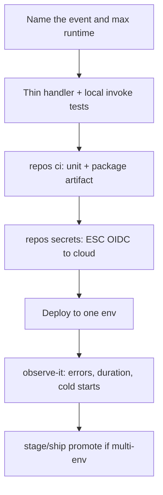

# Compute — Serverless

**Serverless** (functions / managed compute that scales to zero): AWS Lambda, GCP Cloud Functions/Cloud Run *jobs* patterns, Cloudflare Workers (also see [Cloudflare](cloudflare.md)), Azure Functions, etc.

## Fit

- Short, event-triggered work (HTTP, queue, cron)
- Spiky traffic; you don’t want always-on VMs
- Team accepts provider limits (timeouts, payload size, cold starts)

## Skip when

- Long-running workers, sticky websocket farms, or heavy local disk — prefer [Docker](docker.md) / [Clouds](clouds.md)
- You need exotic networking only K8s buys — and you have ops for it ([Kubernetes](kubernetes.md))

## Starter DAG

## Skills

`kiss` · `repos ci` · `repos secrets setup` · `test-it` · `observe-it` · `stage-it` / `ship-it` · `diagnose-bug` on prod failures

## Watchouts

- Timeouts and retry storms
- Secret injection at invoke time (ESC), not baked into zip
- Idempotency for at-least-once delivery
