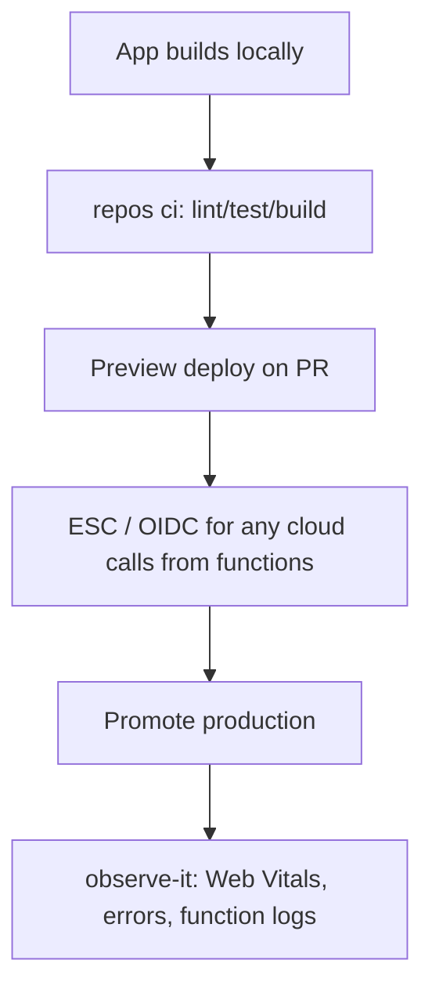

# Compute — Vercel

**Vercel**: host frontend / Next-style apps with preview deployments, edge/serverless functions as the platform provides.

## Fit

- UI-heavy product; preview URLs on every PR matter
- Deploy target is mostly the web app ([Path 01](../01-simple-website.md))
- Stack default: **Next.js + React** ([Web framework selection](../../concepts/10-web-framework-selection.md))
- Backend is thin (route handlers) or lives elsewhere deliberately

## Skip when

- Heavy long-running workers, proprietary networking, or multi-service mesh — [Docker](docker.md) / [Clouds](clouds.md) / [Kubernetes](kubernetes.md)
- You’re only publishing a Python library — [Path 03](../03-python-package.md)

## Starter DAG

## Skills

Impeccable (UI) · `repos ci` · `pulls` · `merge-it` · `ship-it` / host promote · `observe-it` · `kiss` before adding a second host for the same UI

## Watchouts

- Putting the entire backend on Vercel by default when constraints don’t match
- Secrets in the Vercel dashboard *and* GitHub *and* ESC with no source of truth — prefer ESC where possible
