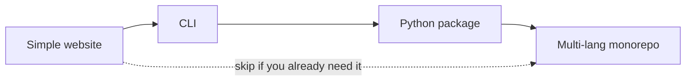
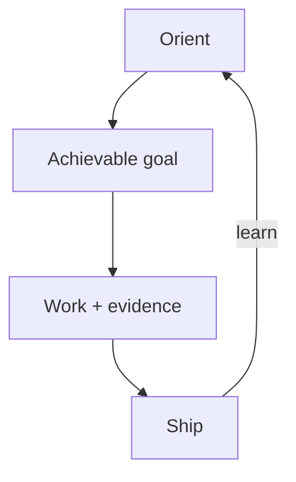

# Project shapes

Part of **[Architecture](../architecture/index.md)**: what kind of artifact are you building? Complexity is earned. This is **not** a rival track to compute — hosts live under [What runs where](../architecture/what-runs-where.md) → [Compute](compute/index.md).

Language and framework bets: [Language selection](../concepts/09-language-selection.md) · [Web framework selection](../concepts/10-web-framework-selection.md).

You do **not** have to walk every step in order. The sequence is a teaching order: each shape adds mechanisms the previous ones deliberately skipped.

| Shape | You are here when… | Default stance |
| --- | --- | --- |
| [01 — Simple website](01-simple-website.md) | One site, one deploy target, few people | Ship thin; refuse monorepo/agent swarms |
| [02 — CLI](02-cli.md) | A command-line tool users install/run | DX + tests + packaging; still one artifact |
| [03 — Python package](03-python-package.md) | Importable library (optional console scripts) | PyPI/private index; API + tests + release |
| [04 — Monorepo](04-monorepo.md) | Multiple packages/languages/deploy units | Boundaries, affected CI, ESC secrets, ownership |

## How to read a shape page

1. Know your [lifecycle phase](../flow/index.md) (Discover / Deliver / Operate / Maintain / Retire).
2. Confirm [Architecture](../architecture/index.md) bets you need (language, framework, placement).
3. Open the shape page → **reading order** and **starter DAG**.
4. When stuck, `idk-now` or `kiss` — don’t invent a fifth language or third web default.

## Shared spine

Strategies and practices remain the modular deck. Shape pages tell you **which cards to draw first**.
