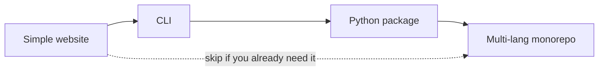
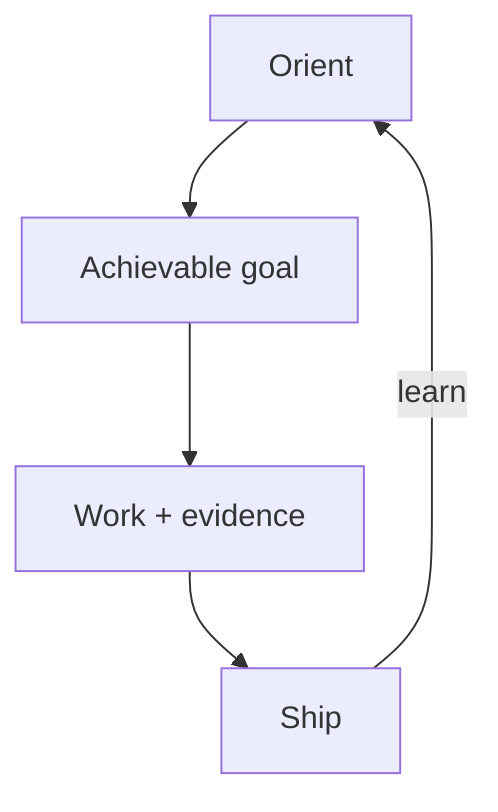

# Project paths

Read this handbook **by project shape** and **compute target**, not by dumping every skill on day one. Complexity is earned.

## Before Track A — Language & web stack

**Languages:** **Python**, **Node/TypeScript**, or **Rust**. Exceptions: **Kotlin** / **Swift** (mobile native), **Godot** (games). See [Language selection](../concepts/09-language-selection.md).

**Web frameworks:** **React** + **Next.js on Vercel** for product/app sites; **Astro Starlight** for documentation/handbook sites. See [Web framework selection](../concepts/10-web-framework-selection.md).

Don’t invent a fourth language or a third web default on a deadline.

## Track A — What you build

You do **not** have to walk every step in order. The sequence is a teaching order: each path adds mechanisms the previous ones deliberately skipped.

| Path | You are here when… | Default stance |
| --- | --- | --- |
| [01 — Simple website](01-simple-website.md) | One site, one deploy target, few people | Ship thin; refuse monorepo/agent swarms |
| [02 — CLI](02-cli.md) | A command-line tool users install/run | DX + tests + packaging; still one artifact |
| [03 — Python package](03-python-package.md) | Importable library (optional console scripts) | PyPI/private index; API + tests + release |
| [04 — Monorepo](04-monorepo.md) | Multiple packages/languages/deploy units | Boundaries, affected CI, ESC secrets, ownership |

## Track B — Where it runs (compute)

Orthogonal to shape: a website might be on Vercel; a worker on Fly; a monorepo unit on GKE. Start from [Compute deployments](compute/index.md).

| Compute | Fit when… |
| --- | --- |
| [Serverless](compute/serverless.md) | Event-driven, spiky, short work |
| [Docker](compute/docker.md) | Portable process image |
| [Kubernetes](compute/kubernetes.md) | Many services + real ops capacity |
| [Vercel](compute/vercel.md) | Frontend / preview deploys |
| [Cloudflare](compute/cloudflare.md) | Edge Workers / Pages |
| [Clouds — AWS, GCP, Fly.io](compute/clouds.md) | Managed IaaS/PaaS |

## How to read a path

1. Skim **[Orientation](../orientation/index.md)** once (vision → situation → skills on hand).
2. Confirm **[language](../concepts/09-language-selection.md)** (defaults vs Kotlin/Swift/Godot exceptions).
3. If it’s web, confirm **[framework](../concepts/10-web-framework-selection.md)** (Next/React on Vercel vs Starlight docs).
4. Open the **shape** path for what you’re building.
5. If something must *run* in the cloud/edge, open the matching **compute** path.
6. Follow that page’s **reading order** and **starter DAG**.
7. When stuck, `idk-now` or `kiss` — don’t invent a sixth cloud, fifth language, or third web framework.

## Shared spine (all paths)

Strategies and practices remain the modular deck. Paths tell you **which cards to draw first**.
