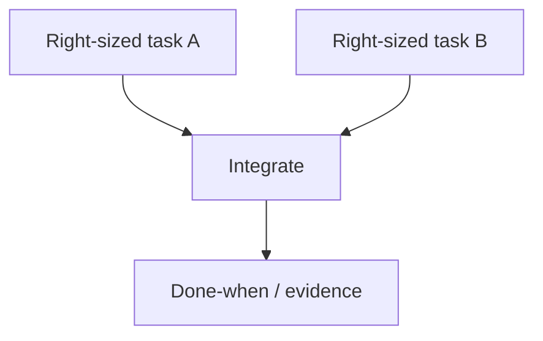

# kiss — DAG and sizing

Use when the `flow` / `dag` lens is active, or when any KISS verdict needs a concrete graph.

## DAG rules

1. Nodes are tasks or stages with a **done-when**.
2. Edges are real dependencies (must finish A before B), not “nice to have order.”
3. Prefer one critical path you can explain in one breath.
4. Fan-out only for true parallelism (independent owners / no shared mutable state).
5. No cycles. If you need iteration, make it an explicit loop stage with a stop condition.

## Mermaid sketch (optional)

## Reshape without reductionism

- Merge nodes that are one thought split for theater
- Split nodes that hide more than one risk boundary
- Rename stages so the DAG matches how work actually ships
- Do **not** delete a validation/safety node just to shorten the diagram
